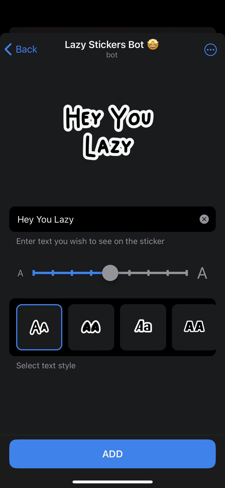
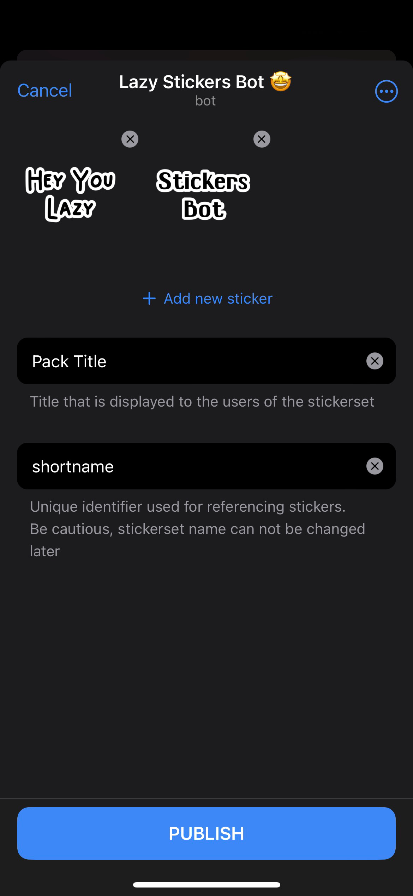

# Telegram Stickers Bot
Allows to create personalised sticker packs. Lets you make your own text stickers for any occasion with just a few clicks using cool graphic interface 💅🛍️


## Iterface



## Running locally

1. Creating Telegram bot and obtaining API token

Visit [this page](https://core.telegram.org/bots/features#botfather) for details.

2. Setup `.env` in `/server` and `/webapp` folders

Manually create `.env` files following the structure in `.env.example`

3. Install dependencies

Run 
`
yarn install
`
in both `/server` and `/webapp` folders


4. Run the app

**DEV mode**

```
cd webapp
yarn dev
```

```
cd server
yarn dev
```

Consider using [ngrok](https://ngrok.com/) to expose locally run webapp to the internet, so that it can be open from Telegram. Don't forget to update `.env` files accordinly.

**PROD mode**

```
cd webapp
yarn build
```

```
cd server
yarn build
node build/index.js
```
