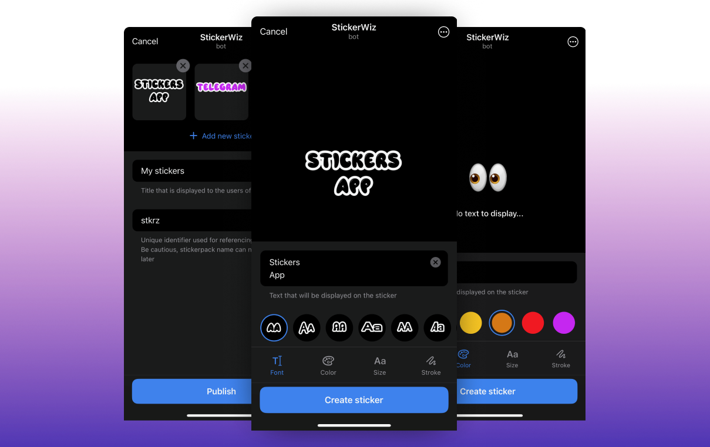

# Telegram Stickers MiniApp




<p align="center">
  <a href="https://t.me/stkrz_bot" style="display: flex; align-items: center; width: min-content;">
 <svg width="16px" height="16px" style="margin-right: 6px" xmlns="http://www.w3.org/2000/svg" xmlns:xlink="http://www.w3.org/1999/xlink" id="Livello_1" data-name="Livello 1" viewBox="0 0 240 240"><defs><linearGradient id="linear-gradient" x1="120" y1="240" x2="120" gradientUnits="userSpaceOnUse"><stop offset="0" stop-color="#1d93d2"/><stop offset="1" stop-color="#38b0e3"/></linearGradient></defs><title>Telegram_logo</title><circle cx="120" cy="120" r="120" fill="url(#linear-gradient)"/><path d="M81.229,128.772l14.237,39.406s1.78,3.687,3.686,3.687,30.255-29.492,30.255-29.492l31.525-60.89L81.737,118.6Z" fill="#c8daea"/><path d="M100.106,138.878l-2.733,29.046s-1.144,8.9,7.754,0,17.415-15.763,17.415-15.763" fill="#a9c6d8"/><path d="M81.486,130.178,52.2,120.636s-3.5-1.42-2.373-4.64c.232-.664.7-1.229,2.1-2.2,6.489-4.523,120.106-45.36,120.106-45.36s3.208-1.081,5.1-.362a2.766,2.766,0,0,1,1.885,2.055,9.357,9.357,0,0,1,.254,2.585c-.009.752-.1,1.449-.169,2.542-.692,11.165-21.4,94.493-21.4,94.493s-1.239,4.876-5.678,5.043A8.13,8.13,0,0,1,146.1,172.5c-8.711-7.493-38.819-27.727-45.472-32.177a1.27,1.27,0,0,1-.546-.9c-.093-.469.417-1.05.417-1.05s52.426-46.6,53.821-51.492c.108-.379-.3-.566-.848-.4-3.482,1.281-63.844,39.4-70.506,43.607A3.21,3.21,0,0,1,81.486,130.178Z" fill="#fff"/></svg>
    stkrz_bot
  </a> 
</p>

## About
A Telegram MiniApp that allows to create personalised sticker packs. Lets you make your own text stickers for any occasion with just a few taps using cool graphic interface 💅🛍️

From developer's perspective this repository might be usefull for those who develop any kind of content management MiniApps, to use as a template or a starting point. Here are the features of the app implementation:

- Neat and tidy UI adapted for different clients (iOS and Android)
- I18n support
- Implemented using Vue.js
- Does not use any UI-kit library

## Running locally

### Telegram API Token
  Before you start, please visit official [Telegram documentation](https://core.telegram.org/bots/features#botfather) for instructions on how to obtain Telegram API token


### Telegram test environment
You can test and develop your MiniApps in Telegram test environment, which is completely separate from the main environment.
For that you'll have to create new separate account and a bot with @BotFather.
Don't forget to set environment variable `DEV=true` in `server/.env` to perform API calls to test environment as well.

[Learn more](https://core.telegram.org/bots/webapps#testing-mini-apps)

### Ngrok
As telegram only allows to open MiniApps available from the internet, we'll need to use [ngrok](https://ngrok.com/docs/getting-started/) to expose our app outside.
Follow [official docs](https://ngrok.com/docs/getting-started/) to install and authenticate ngrok. Then run the following command to start tunnel:

```
  ngrok http 3000 # your server port
```

If you want to launch the app in DEV mode, you'll need to make ngrok instatiate several tunnels at once. For that purpose create ngrok [config](https://ngrok.com/docs/secure-tunnels/ngrok-agent/reference/config/) with the following content:

```
authtoken: yourTokenHere
tunnels:
  first:
    addr: 5173 # server port
    proto: http    
  second:
    addr: 3000 # client dev server port
    proto: http
```

Once cofig file is created/updated, start ngrok with the following command:
```
ngrok start --all
```

### Build
Follow the instructions on how to start/build project in corresponding [webapp](https://github.com/TatianaFomina/stkrz_bot/blob/main/webapp/README.md) and [server](https://github.com/TatianaFomina/stkrz_bot/blob/main/server/README.md) README files.

